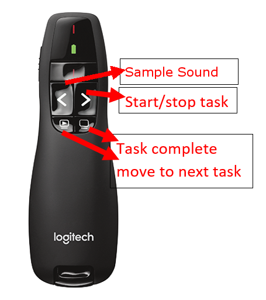

# Gait Test Gui
Project to implement gait test GUI.

Project aims:
- Correct Bluetooth connection isseus with current device
- Communicate with device via USB serial port
- implement random delay and sound indicator to begin measures
- Include controls with Logitec R400 presenter remote

Version 1.0 of the Gait Test GUI implements all current aims.
- The runnable java code must include a reference to the correct serial communication dll (rxSerial.dll) for the correct version of windows, these will be included in the "libs: directory of the zip file. (If you are unable to run, first check that you are using the correct version for your windows type)

- To test program download the zip file for your system build (32 or 64 bit)
- 32bit : https://github.com/ttruty/GaitTestGui/blob/master/GaitTestGUI/build/dist32.zip
- 64bit : https://github.com/ttruty/GaitTestGui/blob/master/GaitTestGUI/build/dist64.zip
- Unzip and run the batch file "RUNGAIT.bat"
- if you do not have a device you can check the "Debug" box
- Sample project ID is 00000136, 
- visit year can be any 2 digits,
- Staff id can be any 3 digits.
- Then you will be able to enter the main test screen

## To Develope
- [Install e(fx)clipe to work with the GUI](https://stackoverflow.com/questions/28011734/some-javafx-classes-cannot-be-resolved-in-eclipse-using-java-se-8u25)
- [Install Java 1.8 on system](https://stackoverflow.com/questions/23746431/jfxrt-jar-not-in-jdk-1-8)
- [Make exe from Java](https://github.com/fabnicolas/launch4j_exe_tutorial)

## UI overview
### Device connection
1. The entry screen allows for 3 user inputs
    - Project ID (8 digit validation)
    - Visit Year (2 digit validation)
    - Staff ID (3 digit validation)

- The connection indicator is the red image towards bottom

2. In order to advance to next screen you must plug in the device while on this screen. IF DEVICE IS ALREAD PLUGGED INTO USB IT MUST BE UNPLUGGED AND REPLUGGED.
    - The connection indicator will turn green when it is connected.

3. Connection and serial commands are sent and recieved as soon as the next screen loads. There is a circle loading indicator to show this.

    - When device is set up for recording an alert will show stating that it is OK to unplug. 
    - Once unplugged the device is recording and can be placed on the test subject.
    - No over connection or programatic interaction is done on device. All markers and trials are done in the java application and marker output is saved to a seporate CSV file.

### Tasks and measures

1. Once device is disconnected and placed on participant the user can start meausre in UI
    - Start Button will make task accessible. 
    - there is also a sample sound button to play the sound that will signal begin movement.
    -  Once Start button is clicked the user can move to the remote for control of tasks.
    - Remote can be used until the end of all performances. (See Remote controls for user controls on remote)

2. When each task is started the backgound of the gridpane will turn green to indicate the start button was pressed.

    - if the task is a walking measure with random delay there will be a wait from 0 - 3000 milliseconds. The user is unable to stop the test during this wait.
    - If balance measure the timer and sound will start immediatly on click.
    - If you need to repeat, do not click next button and just run again.
    - Repeat count is located on the right column.
    - The repeat button should only be used if a repeat is needed after a test was marked at complete. (in current form still needs some debuging as may intefere with remote flow)

3. Once all task are complete (can also stop with any number of task done) Click stop button to deactivate measurement panel
    - This alert the user that the device is ready to be plugged in

4. Once the devie is plugged back in the measure is saved in two files:

    - OMX file is the signal recording on device.
    - CSV file is the marker output from the java program.
- SAVE LOCATION is in the Documents folder under the "GaitFiles" directory. Program created file structure on files run through.

5. User must close the application and restart in order to complete another test.

### Assisted Mode
This is a check button in the file menu bar under help. If the button is checked the program will run in assistem mode, meaning the prompt from the script will be shown to the user before each task.

- Once the task is selected from the main screen, an alert will show with the prompt. The user then can select to "START" or "SKIP". 
- If the user selects "START" that is when the tasks start, so either the delay will begin for the movement tasks, or the task will start if balance.
- Currenly this mode does not work with the remote

## Remote Controls

## Sample Output

